Paleta
======

Find the dominant color palette from any image and manage palettes with Paleta.
An intuitive tool for designers, artists, or anyone looking to streamline their color work.
  

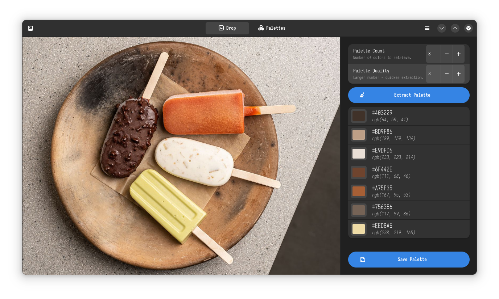
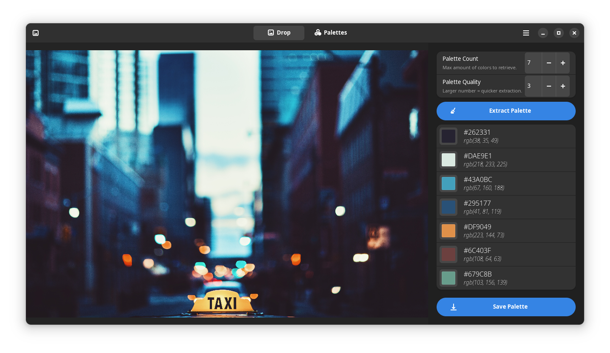

Features
--------------

- Drag and drop images to load
- Color extraction with color-thief
- Save extracted palettes for later use
- Modify saved palette name and colors
- Add new palettes from scratch

Flatpak
--------------

You can install stable builds of Paleta from [Flathub](https://flathub.org)
by using this command:

    flatpak remote-add --if-not-exists flathub https://flathub.org/repo/flathub.flatpakrepo
    flatpak install flathub io.github.nate_xyz.Paleta

Screenshots
--------------

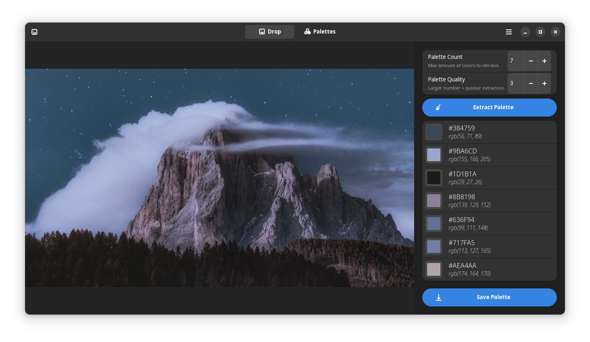
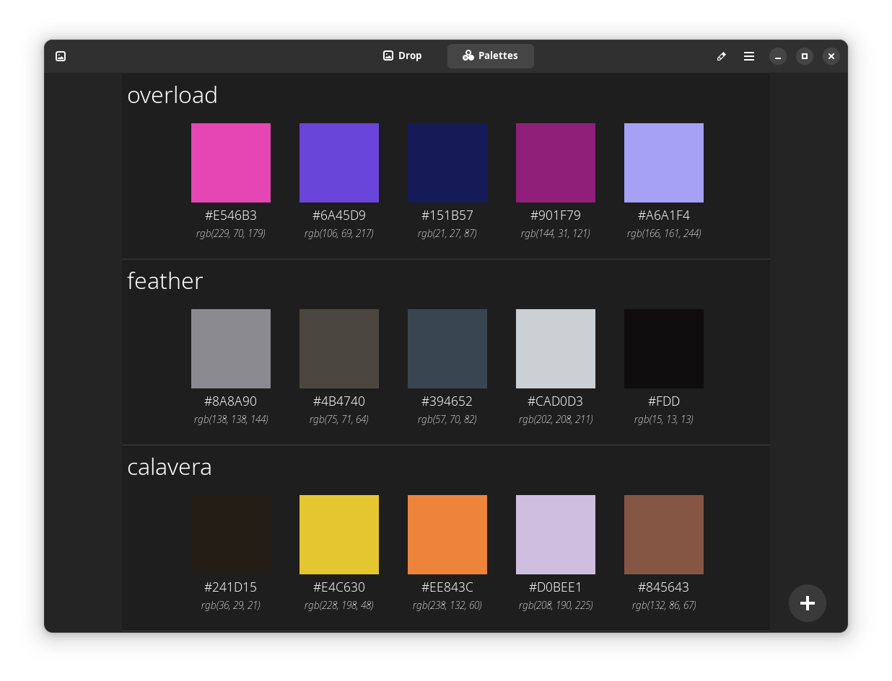
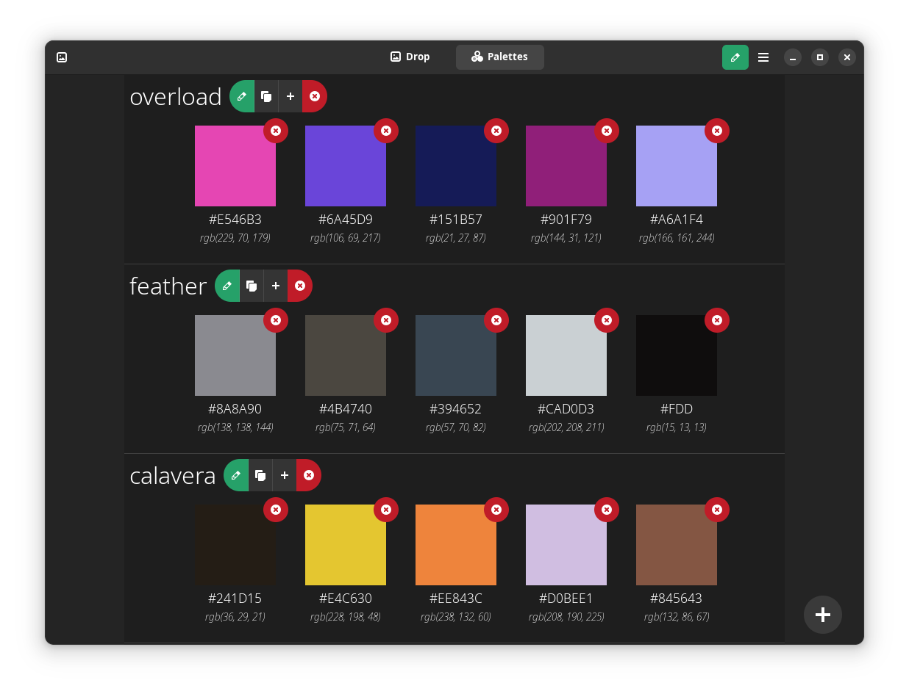
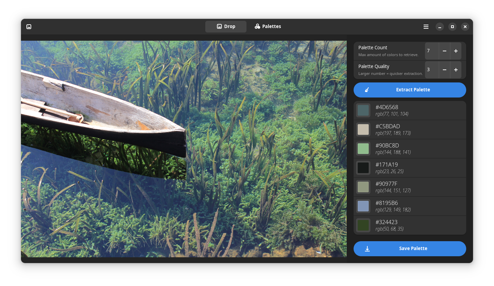

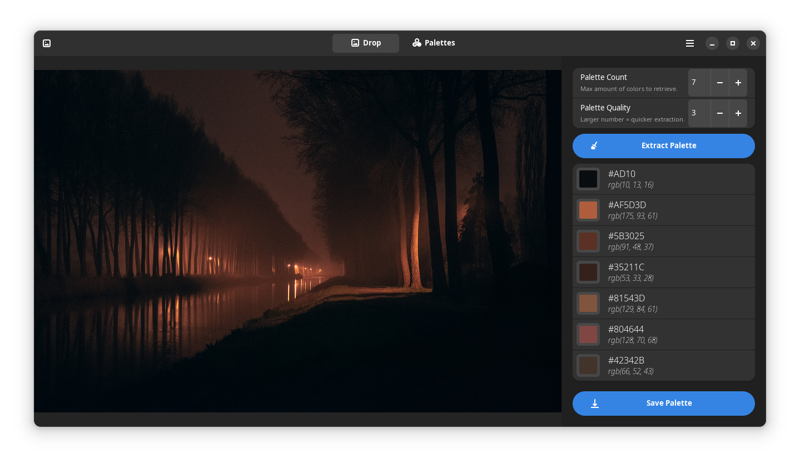
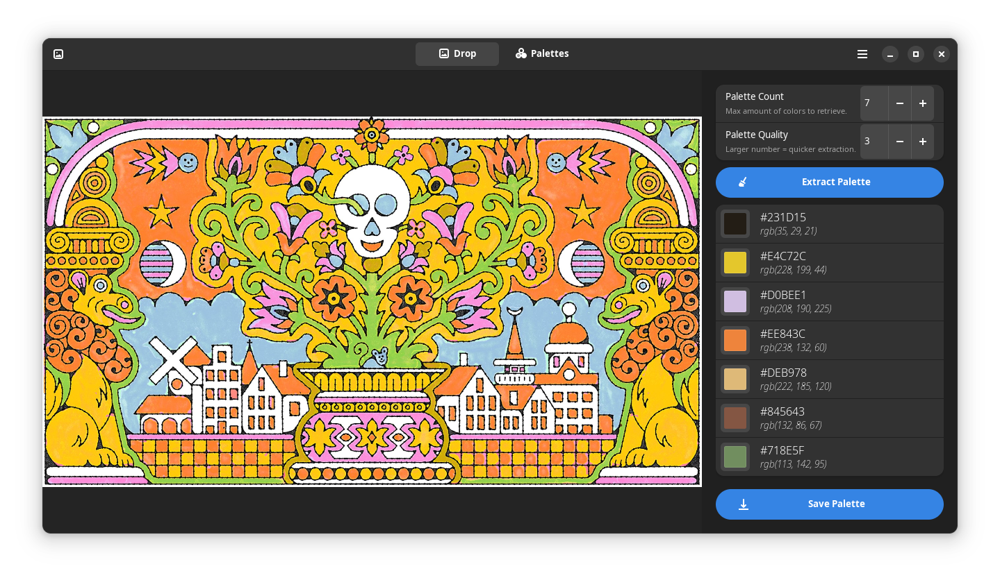
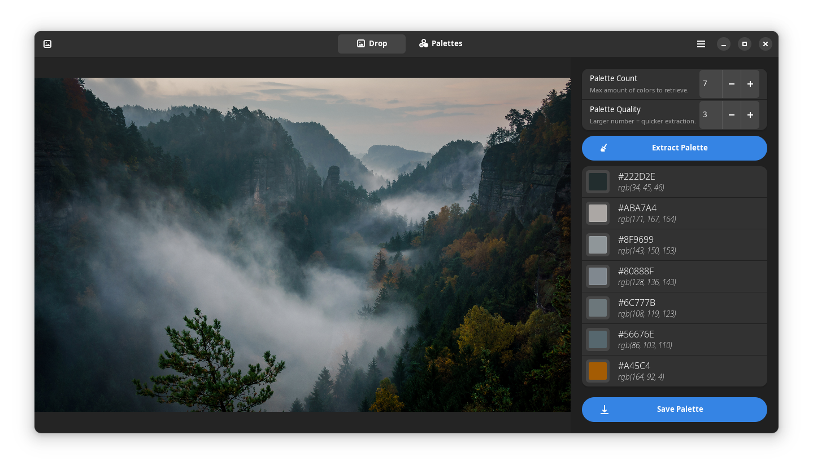
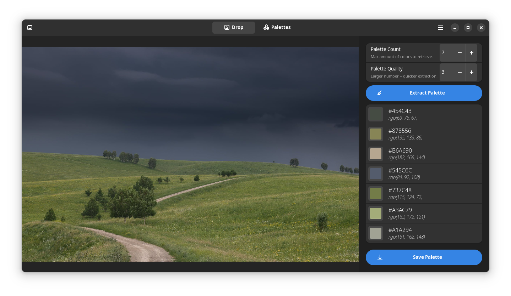
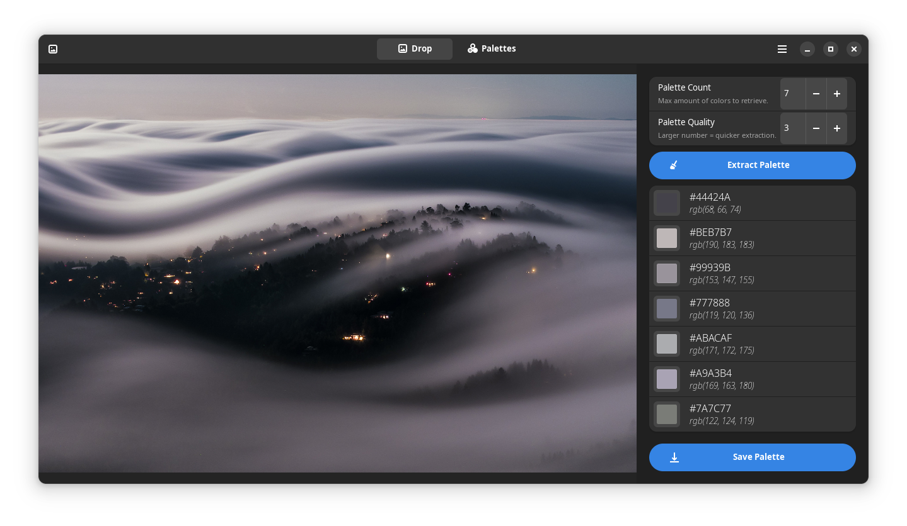
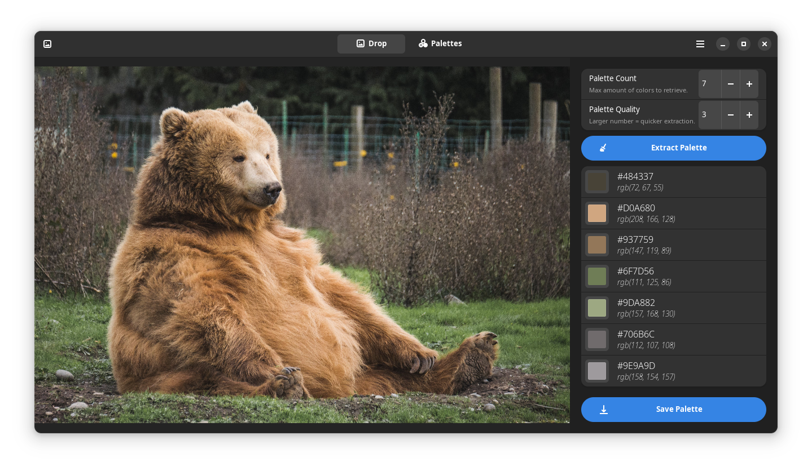
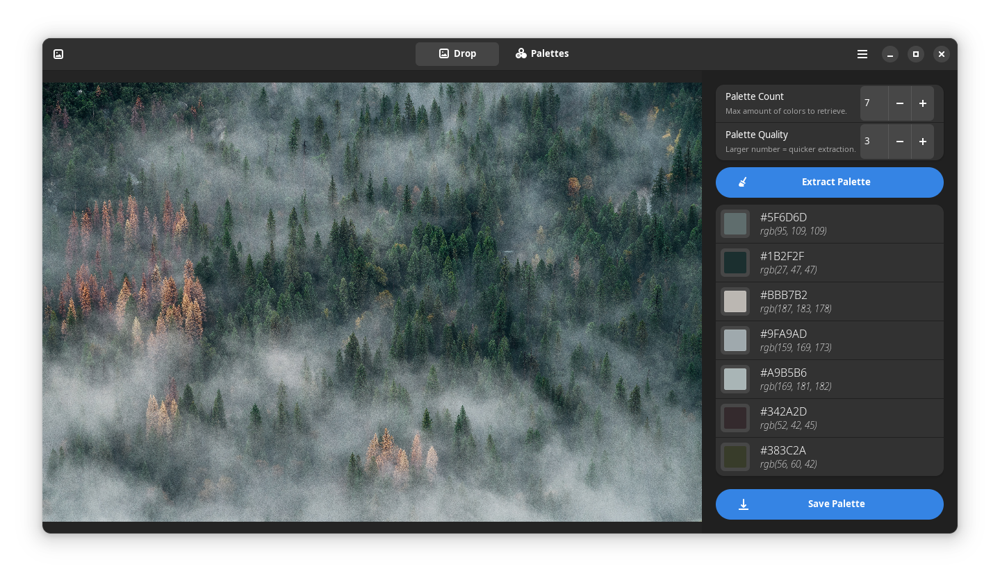
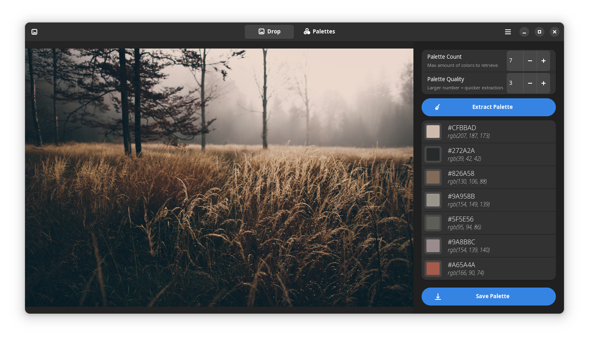